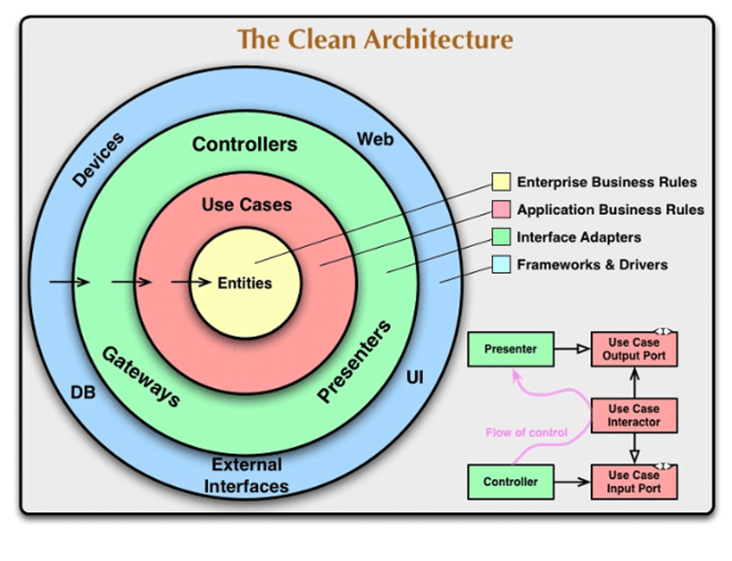

# Beer tap dispenser

Anyone who goes to a festival at least one time knows how difficult is to grab some drinks from the bars. They are
crowded and sometimes queues are longer than the main artist we want to listen!

That's why some promoters are developing an MVP for new festivals. Bar counters where you can go and serve yourself
a beer. This will help make the waiting time much faster, making festival attendees happier and concerts even more
crowded, avoiding delays!

    

## How it works?

The aim of this API is to allow organizers to set up these bar counters allowing the attendees self-serving.

So, once an attendee wants to drink a beer they just need to open the tap! The API will start counting how much flow
comes out and, depending on the price, calculate the total amount of money.

### Workflow

The workflow of this API is as follows:

1. Admins will **create the dispenser** by specifying a `flow_volume`. This config will help to know how many liters of
   beer come out per second and be able to calculate the total spend.

3. Every time an attendee **opens the tap** of a dispenser to puts some beer, the API will receive a change on the
   corresponding dispenser to update the status to `open`. With this change, the API will start counting how much time
   the tap is open and be able to calculate the total price later

3. Once the attendee **closes the tap** of a dispenser, as the glass is full of beer, the API receives a change on the
   corresponding dispenser to update the status to `close`. At this moment, the API will stop counting and mark it
   closed.

At the end of the event, the promoters will want to know how much money they make with this new approach. So, finally, there is
 information about how many times a dispenser was used, for how long, and how much money was made with each
service.

> ⚠️ The promoters could check how much money was spent on each dispenser while an attendee is taking beer!

---

## Getting Started

Within the [Makefile](Makefile) you can handle the entire flow to get everything up & running:

1. Install `make` on your computer, if you do not already have it.
2. Start the application: `make up`
3. Run the application tests: `make test`

As you could see on the [Makefile](Makefile) script and the [Docker-Compose File](docker-compose.yml), the whole API
is containerized with Docker and the API is using the internal DNS to connect with the PostgreSQL instance.

Go to `http://127.0.0.1:8080/ping` to see that everything is up & running!

## Overview

This idea of the project is to implement a [Clean Architecture](https://blog.cleancoder.com/uncle-bob/2012/08/13/the-clean-architecture.html) approach.

    

### Infrastructure

Here you will find the different files to interact with the outside. In this folder you there are two different folders:

* `controllers`: Here you will have the classes that handle the REST endpoints and the Request/Response
* `persistence`: Here it is the persistence layer, which interact with the PostgreSQL database, decoupling the rest of
  the application

### Domain

This level holds core domain objects and interfaces, entities, value objects and aggregates that represents the business 
concept in the system. This layer don't have any dependencies on infrastructure or app details. 

These classes are completely isolated of any external dependency or framework, but interact with them. 

This layer follow the Dependency Inversion principle.

### Application

Application layer holds business logic and rules; use-cases of the system. This level orchestrates the interactions between
the domain level and infrastructure layer. 

## Technologies

* [Java 18](https://openjdk.java.net/projects/jdk/18/)
* [Gradle 7](https://docs.gradle.org/7.0/release-notes.html)
* [Spring boot](https://spring.io/projects/spring-boot)
* [Lombok](https://projectlombok.org/)
* [Junit](https://junit.org/junit5/)
* [JaCoCo](https://docs.gradle.org/current/userguide/jacoco_plugin.html)
* [Docker](https://www.docker.com/)
* [Make](https://www.gnu.org/software/make/manual/make.html)

## License

This project is licensed with the [MIT license](LICENSE).
